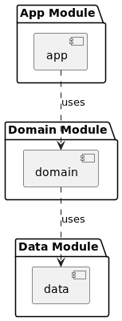

# Music Player App

A modern, Android music player application developed using Kotlin and Jetpack Compose. This app
showcases the use of a multi-module architecture to separate concerns, making the codebase more
maintainable and scalable. It features a rich user interface for browsing and playing music,
leveraging the latest in Android development technologies.

## Architecture

This project adopts a **multi-module architecture**, consisting of the following modules:

- **App Module**: The entry point of the application. It contains the UI components, ViewModels, and
  the necessary setup for dependency injection using Hilt.
- **Domain Module**: Contains the use cases and interfaces for the repository layer, enforcing
  separation of concerns between the data management and UI presentation.
- **Data Module**: Responsible for data fetching, caching, and exposing data to the rest of the
  application. It interacts with external data sources like network APIs.

This separation allows for clear boundaries between the application's core logic, its presentation,
and data handling, promoting a clean architecture.

## Key Libraries

- **Jetpack Compose**: Used for building the UI, offering a modern, declarative approach to UI
  development.
- **Retrofit**: For making network requests to fetch song data from a remote server.
- **OkHttp**: HTTP client used for network requests, including logging interceptors for debugging.
- **Hilt**: Provides dependency injection, simplifying the management of dependencies across the
  application.
- **Coil**: An image loading library optimized for Kotlin and Jetpack Compose, used for loading song
  cover images efficiently.
- **Kotlin Coroutines and StateFlows**: For managing asynchronous tasks and state in a
  lifecycle-aware manner, enhancing the app's responsiveness and performance.

## Kotlin StateFlows

StateFlows are used extensively in this project to manage and emit state updates within ViewModels.
They provide a way to represent a state over time, reacting to user interactions and other
asynchronous events, such as data loading. This approach ensures that the UI always represents the
most current state of the application, enhancing user experience.

## Setup

Refer to the project's `build.gradle` files for specific library versions and setup details. Ensure
you have the latest version of Android Studio for the best development experience with Jetpack
Compose.

### Running the Project

1. Clone the repository.
2. Open the project in Android Studio.
3. Sync Gradle and run the app on an emulator or physical device.

## Contributing

Contributions are welcome! Please read through our contributing guidelines to learn about our
submission process, coding standards, and more.

## License

This project is licensed under the MIT License - see the `LICENSE` file for details.

## Acknowledgments

- Special thanks to all the contributors who have invested their time in contributing to this
  project.
- Thanks to [Android Developers](https://developer.android.com/) for comprehensive documentation on
  Jetpack Compose and Android app development.

---

This README template provides a starting point. You can customize and expand it to better fit your
project's specificities, especially in sections like "Contributing" or "Acknowledgments," where more
personalized details can be beneficial.
